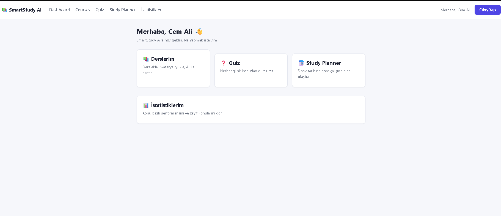
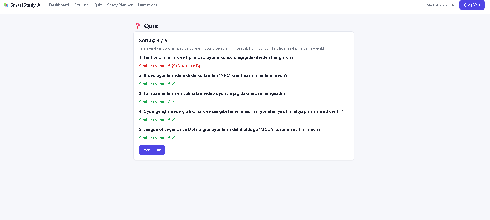
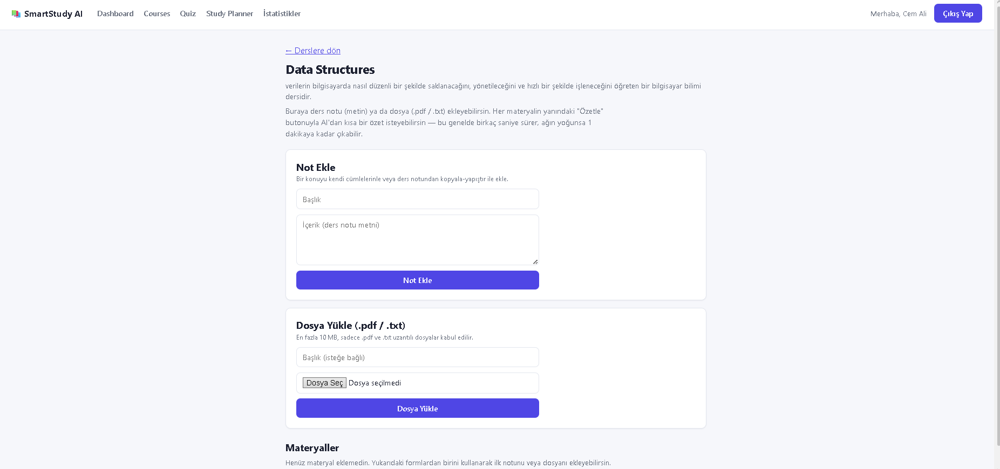
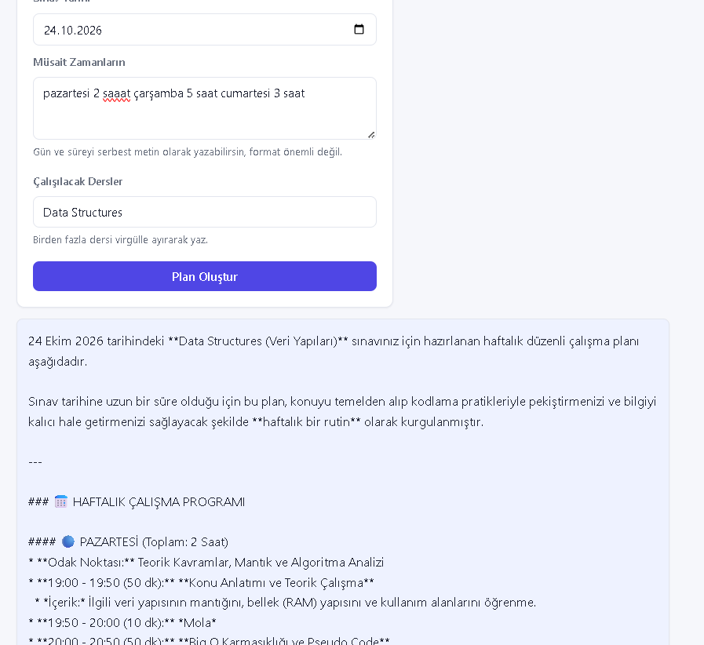
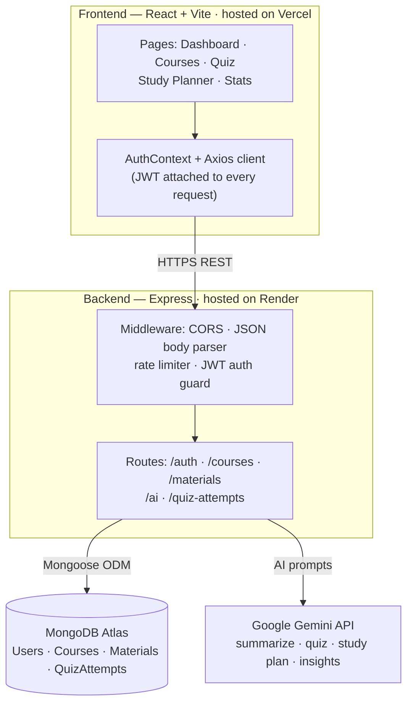

# 🤖 SmartStudy AI

**Turn your study materials into a personalized study plan — automatically.**

SmartStudy AI is an AI-powered study management platform built around one flow:

**📚 Upload study materials → 🧠 AI summarizes them → ❓ AI generates a quiz → 📈 AI builds you a personalized study plan based on how you actually performed.**

It's not just "a project that calls an AI API" — it tracks your quiz results over time,
detects the topics you're weak in, schedules spaced-repetition reviews, and feeds all
of that straight back into your study plan.

**🔗 Live Demo:** [smartstudy-ai-delta.vercel.app](https://smartstudy-ai-delta.vercel.app)

<br>

## 📸 Screenshots

<table>
  <tr>
    <td align="center"><b>Dashboard</b></td>
    <td align="center"><b>AI Quiz — instantly scored</b></td>
  </tr>
  <tr>
    <td></td>
    <td></td>
  </tr>
  <tr>
    <td align="center"><b>Course materials + AI summarization</b></td>
    <td align="center"><b>Personalized study plan</b></td>
  </tr>
  <tr>
    <td></td>
    <td></td>
  </tr>
</table>

<br>

## 🔄 How it works

1. **Add a course and upload materials** — paste lecture notes or upload a `.pdf` / `.txt` file.
2. **Summarize with AI** — get a short Gemini-generated summary of any material in seconds.
3. **Take an AI-generated quiz** — Gemini writes multiple-choice questions on any topic, you answer them in the browser, and get scored instantly.
4. **Get a personalized study plan** — tell it your exam date and available study time, and Gemini builds a week-by-week schedule that *automatically gives more time to the topics you're weak in*, based on your real quiz history.
5. **Track your progress over time** — every quiz attempt is saved. The **Stats** page shows your overall accuracy, a topic-by-topic breakdown, automatically flags weak topics (<60% accuracy), surfaces spaced-repetition review reminders, and — on request — asks Gemini to analyze your quiz history and generate a short, personalized learning assessment.

## ✨ Features

- **Authentication** — secure register/login with JWT and hashed passwords (bcrypt)
- **Courses & Materials** — create courses, add text notes or upload `.pdf` / `.txt` files
- **AI Summarization** — summarize any note or uploaded file with Gemini, rendered as
  formatted Markdown
- **AI Quiz Generator** — generate multiple-choice quizzes on any topic, answer them
  in the browser, and get instantly scored
- **Adaptive AI Study Planner** — generates a personalized schedule based on your exam
  date and available time, and *weights time toward topics you're historically weak in*
- **Quiz History & Weak-Topic Detection** — every quiz attempt is saved and analyzed
  per topic, automatically surfacing the topics you're struggling with
- **Spaced-Repetition Reminders** — each topic gets a "next review" date based on your
  last score (1 day if you scored poorly, up to 7 days if you did well) — one click
  jumps straight into a fresh quiz on that topic
- **AI Learning Insights** — on request, Gemini reviews your full quiz history and
  writes a short natural-language assessment with concrete, actionable advice
- **Stats Dashboard** — overall accuracy, quiz count, and a color-coded topic-by-topic
  performance chart
- **Dark Mode** — a real, theme-token-driven dark palette (not just an inverted filter),
  remembered per-device and defaulting to the OS preference on first visit

## 🏗 Architecture



A request from the browser always goes through the same path: the Express `app`
(rate-limited and behind a JWT check for anything user-specific) either talks to
MongoDB directly (courses, materials, quiz history) or forwards a prompt to Gemini
and relays the response back (summaries, quizzes, study plans, learning insights).
`app.js` only *defines* this app — it holds no database connection or `listen()` call,
so the exact same app can be booted for real traffic (`server.js`) or spun up in-memory
for tests (`tests/`) without touching a real database or port.

Two small pieces of automation sit alongside this at the infrastructure level: a
**GitHub Actions workflow** pings the backend's health endpoint every 10 minutes so
Render's free tier doesn't go to sleep between demos, and a **CI pipeline** runs the
full test suite (plus lint and a production build) on every push.

## 🧱 Tech Stack

**Frontend:** React, Vite, React Router, Axios, `react-markdown`
**Backend:** Node.js, Express
**Database:** MongoDB (Atlas), Mongoose
**AI:** Google Gemini API (`@google/genai`)
**Testing/CI:** Jest, Supertest, `mongodb-memory-server`, Vitest, React Testing Library, GitHub Actions
**Other:** JWT authentication, bcryptjs, Multer (file uploads), pdf-parse, `express-rate-limit`

### Why these choices?

**React + Vite** over Create React App: Vite's dev server and HMR are near-instant,
which mattered a lot working solo and iterating on the UI dozens of times a day.

**MongoDB + Mongoose** over a relational database: the data here is naturally
document-shaped and evolved a lot early on — a `Material` can be a plain note or an
uploaded file with different fields, and a `QuizAttempt` embeds a variable-length
array of question results. Modeling that in a fixed relational schema would have meant
more migrations for less benefit at this scale; the trade-off is weaker referential
guarantees, which is an acceptable cost for a project this size.

**Google Gemini API** over OpenAI: a genuinely practical reason — a generous free tier
was enough to build and run a real AI-native product without a billing account behind
it. All Gemini calls are funneled through one file (`geminiService.js`), which turned
out to matter more than expected — see *Challenges* below.

**JWT (stateless auth)** over server-side sessions: the frontend and backend are two
independent services on two different free hosts (Vercel, Render). JWT means the API
doesn't need a shared session store to stay stateless across those hosts or across
Render restarts.

**Two free hosts (Vercel + Render) instead of one**: mirrors how real production
stacks commonly separate a static frontend from an API, and it's genuinely free. The
real cost of that choice (Render's cold starts) is not hidden — it's the first entry
below.

**`mongodb-memory-server` for tests** instead of mocking Mongoose: the part of this
codebase most worth testing (the stats/weak-topic/spaced-repetition aggregation logic)
*is* a set of MongoDB queries — mocking them away would have tested the mocks, not the
logic.

## 🛠 Engineering Practices

Beyond the user-facing features, this project also has:

- **Automated tests** — backend integration tests (Jest + Supertest against an
  in-memory MongoDB) covering auth and the quiz-stats/weak-topic logic, plus frontend
  unit/component tests (Vitest + React Testing Library).
- **CI on every push** — a GitHub Actions pipeline runs the backend test suite and the
  frontend's lint, test suite, and production build in parallel.
- **Rate limiting** — a stricter limit on the AI endpoints specifically, since those
  are the ones that consume the (free-tier) Gemini quota.
- **Friendly failure modes** — Gemini's raw errors (quota limits, deprecated models,
  network issues) are translated into plain-language messages instead of leaking a
  stack trace to the user.
- **A always-warm demo** — a scheduled ping keeps the free-tier backend from sleeping,
  and the frontend shows an explicit "waking up" state as a fallback if a request is
  ever still slow.

## 📁 Project Structure

```
smartstudy-ai
├── .github/workflows  CI pipeline + backend keep-alive ping
├── client             React frontend (Vite)
│   └── src
│       ├── components
│       ├── pages
│       ├── services
│       ├── hooks
│       ├── context
│       └── utils          small pure helpers, unit-tested in isolation
├── server              Express backend
│   ├── src
│   │   ├── controllers
│   │   ├── services
│   │   ├── routes
│   │   ├── middleware
│   │   ├── models
│   │   └── utils           small pure helpers, unit-tested in isolation
│   └── tests            Jest + Supertest integration tests
└── docs
    └── screenshots
```

## 🚀 Getting Started

### 1. Clone the repo

```bash
git clone https://github.com/LocalinTheEngineer/smartstudy-ai.git
cd smartstudy-ai
```

### 2. Set up the backend

```bash
cd server
npm install
```

Create a `.env` file in `server/` (see `.env.example`) with:

```
PORT=5000
MONGODB_URI=your_mongodb_atlas_connection_string
JWT_SECRET=any_long_random_string
GEMINI_API_KEY=your_google_gemini_api_key
```

Then run:

```bash
npm run dev
```

### 3. Set up the frontend

In a new terminal:

```bash
cd client
npm install
npm run dev
```

The app will be available at `http://localhost:5173` (backend at `http://localhost:5000`).

### 4. Run the tests (optional)

```bash
cd server && npm test    # Jest + Supertest, spins up an in-memory MongoDB
cd client && npm test    # Vitest + React Testing Library
```

## 🧗 Challenges & Learnings

A few real problems hit while building and running this, kept here because the fix
mattered more than the feature it was blocking:

**DNS resolution failing only on some networks.** MongoDB Atlas connection strings
use `mongodb+srv://`, which needs a DNS `SRV` record lookup — and on the ISP this was
first built on, that lookup silently failed (`querySrv ECONNREFUSED`) even though
everything else worked fine. Flushing the OS DNS cache didn't help. The fix was to
stop relying on the OS's configured DNS servers at all and point Node directly at
public resolvers (`dns.setServers(["8.8.8.8", "1.1.1.1"])`) before connecting —
network-independent instead of machine-dependent.

**The AI provider changing the model out from under the app — twice.** Gemini model
names got deprecated mid-project: a working model would suddenly start returning 429
(quota) or 404 ("no longer available, use `model-x`") errors with no code changes on
this end. Because every Gemini call already went through one `geminiService.js`
file, each fix was a one-line model-string swap. The bigger lesson was to actually
read the error message — Gemini's own 404 response names the model to switch to.

**"It works locally but 404s in production" — twice, for two different reasons.**
First: Render's free tier doesn't reliably auto-redeploy on every `git push`, so a
merged feature could sit un-deployed while the *previous* backend version kept
answering requests — a stats endpoint returning 404 turned out to mean "not deployed
yet," not "broken." Second, separately: refreshing the browser on a client-side route
like `/stats` 404'd on Vercel, because a static host looks for a real file at that
path and finds none — React Router owns that path, but the server doesn't know that
without being told. Fixed with a `vercel.json` rewrite that sends every path to
`index.html` and lets the client-side router take over.

**Free-tier cold starts are a real demo risk, not a hypothetical one.** Render sleeps
an inactive free service after 15 minutes, and the first request after that can take
close to a minute. That's a bad first impression for anyone opening the live link
cold — including, potentially, a recruiter. Solved two ways: a scheduled GitHub
Actions ping keeps the backend from sleeping in the first place, and the frontend
tracks in-flight request duration and shows an explicit "the server may be waking
up" message if any request is unusually slow — so a genuinely cold start explains
itself instead of looking broken.

**Setting up a JS testing stack for the first time surfaced two non-obvious config
gaps.** Vitest transformed `.test.jsx` files with a JSX runtime that expected a bare
`React` identifier in scope, throwing `ReferenceError: React is not defined` even
though the app itself built fine — fixed by explicitly setting `esbuild: { jsx:
"automatic" }`. Separately, `@testing-library/jest-dom`'s setup file assumes a
*global* `expect` exists when it runs, which isn't true unless Vitest's `globals:
true` is set — both are one-line fixes once you know to look for them, and neither
produces an error message that names the actual cause.

**Turning on CI retroactively found five pre-existing lint violations** that had
never been surfaced before, because `npm run lint` had simply never been part of the
workflow. Three were a legitimate pattern (fetching data in a `useEffect` on mount)
that a newer, stricter lint rule flags conservatively — documented and suppressed
inline. Two were real: an auth context mixing a non-component export with a component
export in one file (breaks Fast Refresh) and a state update read synchronously from
`localStorage` inside an effect instead of a lazy `useState` initializer — both
genuinely fixed. Good illustration of why CI is worth setting up even on a solo
project: it catches drift that "I'll remember to check" never quite catches.

## 📝 Status

Live, actively maintained, and used as a running example of shipping AI-native
product features (not just an API wrapper) with real engineering practices behind
them — tests, CI, rate limiting, and monitoring for the failure modes a free-tier
deployment actually has.

## 📄 License

This project is for educational/portfolio purposes.
